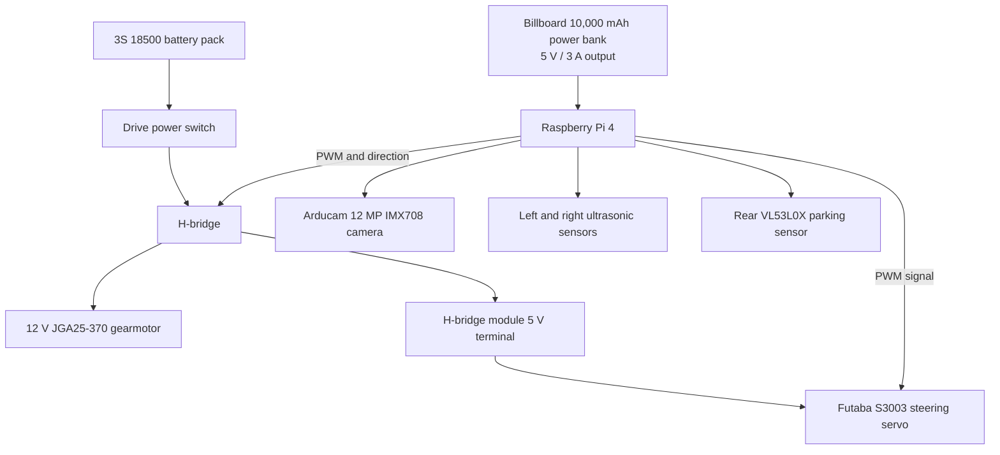
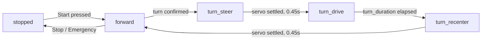

<h1 align="center">Sunbird Nomads</h1>

<h3 align="center">
WRO 2026 Future Engineers · Palestine 🇵🇸
</h3>

<p align="center">
  
</p>

<p align="center">
An autonomous vehicle engineered through testing, failure, redesign, and continuous improvement.
</p>

---

##  Repository Contents

| Folder | Contents |
|---|---|
| [`t-photos/`](t-photos/) | Official and informal team photos |
| [`v-photos/`](v-photos/) | Vehicle photographs from every required angle |
| [`video/`](video/) | Driving demonstration videos |
| [`schemes/`](schemes/) | Electrical and wiring diagrams |
| [`src/`](src/) | Testing and final robot software |
| [`models/`](models/) | 3D-printing and CAD files |
| [`docs/`](docs/) | Engineering diagrams and detailed investigations |

---
##  Why “Sunbird Nomads”?

The **Palestine sunbird** is a small, colourful bird native to our region and recognized as the national bird of Palestine. For Palestinians, it represents our land, identity, freedom, and resilience.

The word **Nomads** reflects our engineering journey constantly exploring, adapting, learning, and moving toward better solutions.

Together, **Sunbird Nomads** represents a Palestinian team deeply rooted in its homeland while continuing to move forward and discover new possibilities.

---
## Our Journey

We are **Alma Alkhader** and **Sara Afifi**, two second-year engineering students at Birzeit University brought together by a shared interest in robotics. This is our second year competing in the WRO Future Engineers category. Our experience began with our [WRO 2025 BiruniVerse project](https://github.com/AlmaAlkhader/WRO2025-BiruniVerse), where we gained our first practical experience designing, building, and programming an autonomous vehicle.

###  Meet the Team

<table>
  <tr>
    <th width="50%">Alma Alkhader</th>
    <th width="50%">Sara Afifi</th>
  </tr>
  <tr>
    <td align="center">
      
    </td>
    <td align="center">
      
    </td>
  </tr>
  <tr>
    <td valign="top">
      <strong>Occupation:</strong> Computer Engineering student<br><br>
      <strong>Academic level:</strong> Second year<br><br>
      <strong>Membership:</strong> IEEE Robotics and Automation Society (RAS), Birzeit University Student Branch<br><br>
      <strong>Interest:</strong> Robotics and autonomous systems<br><br>
      <strong>Team responsibilities:</strong> Power system, electronics, wiring, sensor integration, Raspberry Pi setup, and control software
    </td>
    <td valign="top">
      <strong>Occupation:</strong> Mechanical Engineering student<br><br>
      <strong>Academic level:</strong> Second year<br><br>
      <strong>Membership:</strong> Technical member of IMechE at Birzeit University<br><br>
      <strong>Specialization:</strong> Mechanical design and manufacturing<br><br>
      <strong>Team responsibilities:</strong> Chassis development, steering mechanism, component placement, measurements, and custom-designed mounts
    </td>
  </tr>
</table>

Our different specializations allowed us to approach the robot from two connected perspectives. Alma concentrated on making the electronics and software work reliably, while Sara focused on ensuring that the mechanical design could support those systems and move effectively. Nearly every improvement required both sides to work together.

Our first robot of the 2026 season came to life on **May 19, 2026**, powered by an ESP32. Although it completed the Open Challenge, it still faced major issues with steering, power delivery, and the rear axle. Over the following weeks, we redesigned and improved these systems while balancing the project with our university exams and coursework.

By the local competition on **July 13, 2026**, the robot had evolved significantly. After moving from the ESP32 to a Raspberry Pi and making several mechanical and electrical improvements, it achieved the maximum score in the Open Challenge. We earned **second place** and qualified for the national competition.

We are proud of how far the robot has come, but our journey is not finished. Every test, mistake, and redesign has taught us something new, and we are continuing to improve the robot as we prepare for the next stage of the competition.

## Design Strategy

Our robot is built on a **4WD Arduino RC car chassis**, which we chose as a reliable starting point that allowed us to focus on developing and improving the robot for the WRO Future Engineers competition.

While the kit provided a solid foundation, it also presented several challenges:

* **Limited space** for mounting electronic components, requiring us to carefully redesign the layout and create custom 3D-printed mounts.
* **Minimal assembly documentation**, which led us to reverse-engineer parts of the chassis and solve several mechanical issues during development.

As the project evolved, we continuously modified the original design to better meet the competition's requirements, improving the mechanical structure, electronics integration, and overall reliability.

For future iterations, we plan to redesign the bottom chassis plate to improve the overall structure of the robot. The new design will provide additional clearance for the steering mechanism, enabling a larger steering angle and improved maneuverability during the Obstacle Challenge. Additionally, we aim to make the chassis more modular and accessible, simplifying the assembly and disassembly process while making maintenance and future upgrades easier.
# Hardware Design
## Chassis

Our robot is based on the **4WD Arduino RC Car Chassis**, which provided a solid mechanical foundation, offering rear wheel drive. However, the original design offered very little space for the electronics required for the competition.

To overcome this limitation, we designed a completely new **top mounting plate** and added an **additional layer** to accommodate all of the robot's electronic components while maintaining a compact and organized layout.

<p align="center">
  
  <br>
  <em>Original 4WD Arduino RC Car Chassis used as the base of our robot.</em>
</p>

After identifying all the required electronic components and taking precise measurements, we designed a custom mounting plate tailored to our needs. The design went through **four iterations**, with each version improving the placement of components, cable management, and accessibility until we reached the final design.

<table align="center">
  <tr>
    <td align="center">
      <br>
      <em>Early prototype</em>
    </td>
    <td align="center">
      <br>
      <em>Final design</em>
    </td>
  </tr>
</table>

<p align="center">
  <em>Middle and top layer plates</em>
</p>

## Steering Calibration

One advantage of the chassis kit we used is that it allows adjustments to the steering geometry by changing the lengths of the steering rods. We utilized this flexibility to implement an **Ackermann steering mechanism**, where the inner wheel turns at a greater angle than the outer wheel during cornering.

<p align="center">
  
</p>

This difference in steering angles is necessary because the inner and outer wheels follow different turning radii. The inner wheel travels along a smaller radius, requiring a larger steering angle to ensure that all wheels rotate around the same instantaneous center of rotation.

To determine the required steering angle for **low-speed cornering**, where tire slip can be neglected, we used the following relationship:

```text
δ = atan(L / R)
```

Where:

```text
δ = steering angle of the vehicle centerline
L = wheelbase
R = turning radius
```

For our robot, we measured:

```text
L = 137 mm
R = 525 mm
```

Substituting these values:

```text
δ = atan(137 / 525)
δ = 14.6°
```

After converting the result from radians to degrees, the required steering angle was approximately **15°**.

We then calibrated the steering mechanism by adjusting the steering rods until the wheels achieved the desired Ackermann geometry, with approximately a **15° steering angle** for the centerline turn.

## Mounts

To ensure reliable performance during the competition, important components such as the **Pi Camera** and distance sensors required custom-designed mounts to keep them securely positioned while maintaining accessibility and accuracy.

### ToF Sensor Mount — Initial Design

Our first approach was to use **Time-of-Flight (ToF) sensors** for obstacle detection. After several design iterations, we developed a dedicated mount that provided a stable position and proper alignment for the sensors.

<p align="center">
  
  <br>
  <em>Initial ToF sensor mount design.</em>
</p>

However, during testing, we discovered that ToF sensors were not ideal as our main wall sensors in the WRO mat environment. Their infrared-based measurements were affected by dark surfaces and target geometry. We therefore replaced the side-facing ToF plan with ultrasonic wall sensing, while retaining one rear VL53L0X for short-range parking alignment.

### Ultrasonic Sensor Mount — Final Design

After evaluating different sensor options, we switched to **ultrasonic sensors**, which required a new mounting solution.

<p align="center">
  
  <br>
  <em>Final ultrasonic sensor mount design.</em>
</p>

This design uses a **friction-fit mechanism** to securely hold the sensor in place, eliminating the need for screws while making installation and adjustments faster and easier.

### Pi Camera Mount

The camera is one of the most important components for navigation, requiring a stable and precise mounting position. We designed a dedicated mount that keeps the camera firmly fixed while providing an unobstructed field of view for the lens.

<p align="center">
  
  <br>
  <em>Custom Pi Camera mount positioned at the front of the robot.</em>
</p>

The mount secures the camera using screws and includes an opening for the lens. It is installed vertically on the robot's second level, facing forward with its optical axis approximately parallel to the field. This gives it an unobstructed view of the red and green traffic pillars. The **"SN"** engraved on our mounts refers to our team name, **Sunbird Nomads**.

# Power & Sensor Architecture

Our electrical design separates the noisy, high-current drive system from the Raspberry Pi's processing supply. A three-cell motor battery powers the H-bridge, drive motor, and steering-servo rail, while a dedicated USB power bank powers the Raspberry Pi 4 and camera. The two sources share a common ground so that the Raspberry Pi's control signals have the same electrical reference as the H-bridge and servo.

This section uses the robot's confirmed configuration, values recovered from our project records, and manufacturer specifications. No unrecorded measurement is presented as a test result.

## System Architecture



The power switch energizes the drive system. A separate start control launches the autonomous program, allowing the robot to be powered and checked before motion begins.

## Power Sources and Distribution

| Source or rail | Connected loads | Confirmed information |
|---|---|---|
| 3S motor pack | L298N H-bridge, drive motor, servo rail | 3 × 18500 Li-ion cells, each labelled 3.7 V and 2250 mAh |
| USB power bank | Raspberry Pi 4, camera, and Pi-side sensors | Billboard 10,000 mAh, 5 V / 3 A output |
| L298N motor output | JGA25-370 12 V gearmotor | PWM speed and direction control |
| H-bridge module 5 V terminal | Futaba S3003 steering servo | Servo power and ground; control signal from Raspberry Pi GPIO12 |
| Raspberry Pi 3.3 V and GPIO | Ultrasonic and ToF sensor logic | Common ground through the breadboard negative rail |

The Raspberry Pi 4 requires a good-quality **5 V, 3 A** USB-C supply according to its [official datasheet](https://pip.raspberrypi.com/documents/RP-008341-DS-raspberry-pi-4-datasheet.pdf). The power bank's labelled output matches that supply requirement.

### 3S Motor-Battery Calculation

The cells are connected in series. Series connection adds voltage, but it does **not** add ampere-hour capacity:

```text
Nominal pack voltage = 3 × 3.7 V = 11.1 V
Fully charged voltage = 3 × 4.2 V = 12.6 V
Pack capacity = 2.25 Ah
Nominal stored energy = 11.1 V × 2.25 Ah = 24.975 Wh ≈ 25.0 Wh
```

The motor is sold as part of a 12 V robot kit, so a 3S lithium-ion pack is electrically close to its intended voltage range: approximately 12.6 V when full and 11.1 V at nominal charge. The actual voltage reaching the motor is lower because the H-bridge has an internal voltage drop.

### H-Bridge Trade-off and Voltage Loss

Our project records identify the motor driver as an **L298N dual H-bridge**.

The [STMicroelectronics L298 datasheet](https://www.st.com/resource/en/datasheet/l298.pdf) specifies a total bridge saturation-voltage drop of approximately **1.8 V typical and up to 3.2 V at 1 A**. At a nominal 11.1 V pack voltage:

```text
Motor voltage ≈ battery voltage − bridge drop
Best reference case: 11.1 V − 1.8 V = 9.3 V
High-drop case:      11.1 V − 3.2 V = 7.9 V
```

The corresponding driver heat at 1 A is approximately:

```text
Driver loss = current × voltage drop
             = 1 A × (1.8 to 3.2 V)
             = 1.8 to 3.2 W
```

This older bipolar driver is simple and readily available, but it sacrifices motor voltage and produces more heat than a modern MOSFET driver. We retained it because it was already integrated and provided the required PWM speed and direction control.

## Documented Electrical Load Data

| Component | Supply or rating | Documented electrical data | Source |
|---|---:|---|---|
| Raspberry Pi 4 | 5 V | 3 A recommended supply capability | [Raspberry Pi 4 datasheet](https://pip.raspberrypi.com/documents/RP-008341-DS-raspberry-pi-4-datasheet.pdf) |
| 2 × HC-SR04 | Installed at 3.3 V | Standard reference module: 15 mA each at 5 V | [HC-SR04 datasheet](https://cdn.sparkfun.com/datasheets/Sensors/Proximity/HCSR04.pdf) |
| VL53L0X | 2.6–3.5 V bare sensor | 19 mA typical active; up to 40 mA peak | [STMicroelectronics VL53L0X datasheet](https://www.st.com/resource/en/datasheet/vl53l0x.pdf) |
| Futaba S3003 servo | 4.8 or 6 V | 8 mA idle at 6 V; 3.2 kg·cm torque and 0.23 s/60° at 4.8 V | [Futaba S3003 datasheet](https://futabausa.com/wp-content/uploads/2019/07/S3003.pdf) |
| JGA25-370 gearmotor | 12 V | 70–150 mA no-load; 1.5–2.5 A stall range recorded in our [2025 component documentation](https://github.com/AlmaAlkhader/WRO2025-BiruniVerse/blob/main/README.md#dc-motor-jga25-370) | Team component record |
| L298N H-bridge | Motor supply up to 46 V | 2 A DC per channel; 3 A non-repetitive peak per channel | [STMicroelectronics L298 datasheet](https://www.st.com/resource/en/datasheet/l298.pdf) |

The power sources are intentionally separated: the 3S pack handles drive and steering loads, while the USB power bank isolates the Raspberry Pi and vision system from motor-current transients.

## Signal and GPIO Map

| Device | Function | BCM GPIO | Physical pin | Interface |
|---|---|---:|---:|---|
| Left ultrasonic | Trigger | GPIO5 | 29 | Digital output |
| Left ultrasonic | Echo | GPIO6 | 31 | Digital input |
| Right ultrasonic | Trigger | GPIO20 | 38 | Digital output |
| Right ultrasonic | Echo | GPIO21 | 40 | Digital input |
| Rear VL53L0X | SDA | GPIO2 | 3 | I²C data |
| Rear VL53L0X | SCL | GPIO3 | 5 | I²C clock |
| Steering servo | PWM signal | GPIO12 | 32 | 50 Hz PWM |
| H-bridge enable | Motor speed | GPIO13 | 33 | 1 kHz PWM |
| H-bridge IN1 | Motor direction | GPIO23 | 16 | Digital output |
| H-bridge IN2 | Motor direction | GPIO24 | 18 | Digital output |

All grounds are joined on the breadboard negative rail. This common reference is necessary because the Pi sends control signals to devices powered from the motor-side supply.

## Sensor Roles, Selection, and Placement

| Sensor | Final role | Why it was selected | Main limitation |
|---|---|---|---|
| Left ultrasonic | Measure distance to the left wall and detect openings | Measures by reflected sound, so wall colour has much less influence than on optical ranging | Wide beam can reflect from angled surfaces; can cross-talk with another ultrasonic sensor |
| Right ultrasonic | Measure distance to the right wall and detect openings | Same device type on both sides simplifies comparison and replacement | Requires timing separation and has a 2 cm reference blind zone |
| Rear VL53L0X ToF | Short-range parking alignment | Narrower optical field of view is useful for alignment with the rear parking boundary | Infrared return can depend on target reflectance, angle, and cover-glass crosstalk |
| Arducam 12 MP IMX708 | Detect red and green traffic pillars | High-resolution colour frames support HSV segmentation and pillar-position estimation | Processing full-resolution frames increases latency; fixed focus reduces near-field sharpness |

The ultrasonic sensors face left and right so that each one has a direct line of sight to one track wall. This placement supports wall-distance comparison and exposes the sudden open-space reading used to identify corners. The rear-facing ToF sensor is separated from this navigation pair because its role is parking clearance rather than turn detection.

The rear ToF sensor is used specifically for **parking**, not front obstacle detection. It measures the remaining rear clearance during the final parking maneuver.

### Placement Constraints from Field Geometry

The [WRO 2026 Future Engineers rules](https://wro-association.org/wp-content/uploads/WRO-2026-Future-Engineers-Self-Driving-Cars-General-Rules.pdf) define physical targets that directly affect sensor placement:

| Field feature | Rule dimension | Design consequence |
|---|---:|---|
| Interior and exterior walls | 100 mm high | The ultrasonic acoustic center should remain below the wall top and clear of wheels/mounts |
| Traffic pillars | 50 × 50 × 100 mm | Camera resolution must preserve a useful contour for a 50 mm-wide target at the required detection distance |
| Parking boundary elements | 200 × 20 × 100 mm | Rear ToF line of sight must intersect the 100 mm-high element during parking |
| Maximum vehicle envelope | 300 × 200 × 300 mm | Camera and sensor mounts must remain inside the permitted footprint and height |
| Obstacle Challenge track width | 1000 ± 10 mm | Side ranges must cover the relevant wall distance while leaving margin for turns and openings |

The HC-SR04 reference datasheet lists a **15° measuring angle**. Approximating this as a conical beam, its footprint width at target distance $d$ is:

$$W_{US}=2d\tan(15^\circ/2)$$

| Target distance | Approximate ultrasonic footprint width |
|---:|---:|
| 20 cm | 5.3 cm |
| 50 cm | 13.2 cm |
| 100 cm | 26.3 cm |

Ultrasonic sensors detect objects across a wide area, so they may sometimes pick up nearby wheels, mounts, corners, or angled walls instead of the intended wall. The rear VL53L0X sensor observes a smaller area, making it more suitable for precise parking-distance measurements.

### Ultrasonic Timing and Crosstalk Control

The standard HC-SR04 datasheet recommends a measurement cycle longer than **60 ms**. Our code does not trigger both sensors together: it reads the left sensor, waits **60 ms**, then reads the right sensor. Sequential triggering reduces the chance that one receiver mistakes the other sensor's sound burst for its own echo.

The control loop also applies a three-sample median filter. A median rejects one isolated high or low reading without being shifted as strongly as a mean:

```text
Filtered distance = median(last three valid readings)
```

This filtering and delay improve robustness at the cost of a slower sensing update. The dashboard therefore prioritizes stable wall readings over maximum update rate.

### HC-SR04 Voltage Configuration

The installed ultrasonic sensors operate when powered from **3.3 V**, and no Echo voltage divider is used. This is the robot's observed configuration. The commonly published HC-SR04 reference sheet instead specifies **5 V operation**, while Raspberry Pi GPIO uses a **3.3 V I/O rail**. For that reason, this repository does not generalize the robot's observed 3.3 V behaviour to every HC-SR04 board revision.

## Camera Hardware and Colour Pipeline

The current upgrade is an **Arducam 12 MP IMX708 fixed-focus HDR camera**. Arducam specifies a maximum sensor resolution of **4608 × 2592**, a 1.4 µm pixel size, and a fixed-focus range listed as 1.5 m to infinity for this module family in its [IMX708 documentation](https://docs.arducam.com/Raspberry-Pi-Camera/Native-camera/12MP-IMX708/). The camera is used for colour detection rather than full-resolution recording.

The existing colour-detection program uses **Picamera2** for capture and **OpenCV** for BGR-to-HSV conversion and contour detection. The currently recorded code values are:

| Parameter | Current code value |
|---|---|
| Green HSV lower bound | `[115, 200, 100]` |
| Green HSV upper bound | `[160, 255, 180]` |
| Red HSV lower bound | `[0, 80, 60]` |
| Red HSV upper bound | `[30, 255, 255]` |
| Minimum contour area | `800 px²` |
| Loop delay | `0.05 s` |

Picamera2 is the Python interface to Raspberry Pi's `libcamera`-based camera stack, as described in the [official Raspberry Pi camera documentation](https://www.raspberrypi.com/documentation/computers/camera_software.html). The new camera is producing colour detections with the recorded OpenCV pipeline.

## Recorded Integration Observations

These are the exact values retained from earlier individual hardware checks. They confirm communication, but the true target distances were not recorded, so they cannot be used to claim accuracy.

| Device | Recorded observation | What it proves | What it does not prove |
|---|---:|---|---|
| VL53L0X | 159 mm, followed by changing readings | I²C initialization and live ranging worked | Accuracy, parking repeatability, or surface independence |
| Left ultrasonic | Approximately 47–49 cm | Trigger/Echo path returned plausible changing data | Error at a known distance or invalid-reading rate |
| Right ultrasonic | 8.9 cm | Individual sensor read worked at short range | Cross-sensor consistency or calibrated accuracy |

## Failure-Point Analysis

| Failure mode | Effect on robot | Current design response |
|---|---|---|
| Two ultrasonic bursts overlap | False wall distance and incorrect turn decision | Sensors are triggered sequentially with 60 ms separation and a median-of-three filter |
| L298N voltage drop | Reduced motor voltage and power lost as heat | The loss is calculated above and the robot uses conservative PWM settings |
| Motor electrical noise reaches processing electronics | Sensor errors or controller reset | The Raspberry Pi and camera use a separate USB power bank while all control signals retain a common ground reference |
| Camera colour shifts | Missed or incorrect pillar classification | HSV bounds are combined with an 800 px² contour-area threshold |
| Ultrasonic VCC/GND reversed | Sensor heating and possible damage | The earlier incident was stopped immediately; common-rail wiring and pin checks were adopted afterward |
| Unprotected 3S cell pack is overcharged, over-discharged, imbalanced, or shorted | Cell damage, heating, fire risk, or sudden shutdown | The pack has a physical isolation switch, but no BMS or fuse is installed |

The switch is useful for isolation, but it is **not** a substitute for a battery-management/protection circuit or fuse. The absence of a BMS and overcurrent protection is the highest-priority electrical risk in the current design.

## 🚀 Software Architecture & Obstacle Strategy

To test and calibrate the robot, we built a live browser dashboard that runs alongside the control code on the Raspberry Pi — showing sensor readings, drive state, and steering in real time, with manual override controls for tuning before autonomous runs.


*The dashboard shown in its idle state — sensor readings populate live once connected to the robot.*

**This is a testing and calibration build for the Open Challenge (Task 1), not competition code** — see [`src/testing/`](src/testing) for the full source.

### Drive state machine

The robot runs as a simple state machine rather than a continuous control loop:



Every phase transition explicitly stops the motor first, moves the servo, waits for it to physically settle, then resumes — this was a deliberate choice over changing steering angle while still driving, since accessories mounted this close to the servo left very little margin for the wheel to catch a mount mid-turn.

### Turn decision — the math

Every ~340 ms sensor cycle, both ultrasonic readings are median-filtered (window of 3, to reject single-sample noise), giving left distance $L$ and right distance $R$ in cm. We compute:

$$\Delta = |L - R|, \qquad r = \frac{\max(L,R)}{\max(\min(L,R),\ 1)}$$

A turn is only considered when:

$$\Delta \geq 35 \text{ cm} \quad \text{OR} \quad (\Delta \geq 20 \text{ cm} \ \text{AND} \ r \geq 1.8)$$

The ratio clause exists because a fixed centimeter threshold alone misses proportionally large gaps at short range — 15 cm vs. 30 cm ($\Delta=15$) is a real opening but falls under a flat 20 cm cutoff, while 20 cm vs. 40 cm ($\Delta=20,\ r=2.0$) clearly should trigger. Combining both catches that case without lowering the flat threshold enough to react to noise.

Even when the threshold is crossed, the robot doesn't turn immediately — it requires **3 consecutive sensor cycles** to agree on the same direction before committing, and at least **1.5 seconds** of forward driving since the last decision. Both are debounce measures: the first against a single noisy reading, the second against immediately re-triggering right after finishing a turn.

Once committed, it's a **timed maneuver, not a sensor-confirmed exit**: stop → steer → drive for a fixed duration → stop → recenter → resume. The turn doesn't end because the sensors say it's clear; it ends because the clock says so. This is simpler and more predictable to tune than closing the loop on sensor feedback, at the cost of needing the timing recalibrated if speed or the track layout changes.

### Steering angle → servo duty cycle

The servo is commanded by PWM duty cycle, mapped linearly from the calibrated angle range:

$$\text{duty}\% = 2.5 + \frac{\theta - 30}{120}\times 10$$

| Position | Angle | Duty cycle |
|---|---|---|
| Left | 81° | 6.75% |
| Center | 106° | 8.83% |
| Right | 131° | 10.92% |

### Safety systems

- **Heartbeat watchdog:** the browser sends a signal once per second; if it's missing for **3 seconds**, the robot force-stops and recenters automatically, whether or not anyone pressed a button.
- **Motor always stops before steering changes** — never commanded to turn and drive in the same instant.
- **Clean shutdown on Ctrl+C / SIGTERM:** stop motor, recenter servo, stop PWM, release GPIO.

### Known constraints (by design, not oversight)

- Speed and distance are **open-loop estimates** — `estimated_speed = max_speed_cm_s × pwm% / 100`, integrated over time. There's no wheel encoder, so these numbers are useful for tuning consistency but aren't ground truth.
- The servo has no position feedback; the dashboard shows the *commanded* angle only, never a measured one.

## 🧭 Systems Thinking & Engineering Decisions

Every version of this robot exists because an earlier version failed at something specific. This section is the honest version of that story — what we planned, what actually happened, and why we changed course each time.


### The plan we started with vs. the robot that actually exists

Early in the season we scoped an ambitious electrical architecture. Most of it didn't survive contact with real hardware — and that's a normal part of engineering, not a failure to hide.

| Subsystem | Original plan | What we're actually running | Why it changed |
|---|---|---|---|
| Motor driver | BTS7960 (high-current) | L298N H-bridge | The simpler driver reduced wiring complexity and provides the required PWM speed and direction control |
| Distance sensing | 3× VL53L0X ToF via TCA9548A multiplexer | 1× rear VL53L0X + 2× ultrasonic (left/right) | The multiplexed ToF setup failed to initialize reliably over I²C, *and separately* ToF readings proved unreliable near the mat's black surfaces — two independent reasons pointing the same direction |
| Orientation sensing | MPU6050 IMU | Not present | Cut for now to reduce integration surface while the core drive loop was still being stabilized |
| Power | Protected 3S pack, dual-pack rotation, BMS, two buck converters (5 V logic / 5.5 V servo) | 3S 18500 pack + USB-C power bank (Pi), servo supplied from the H-bridge module's 5 V terminal | Separate motor/Pi sources reduce conducted noise; the unprotected cell pack remains the major electrical risk |


We're not presenting the original plan as a mistake — it was the correct engineering target. What changed is that we chose reliability and debuggability under a real deadline over sophistication we couldn't yet fully verify. That trade-off itself is the point of this section.

### Problems encountered — and what we did about each one

**1. ToF sensors were the wrong tool for this mat, twice over.**
Our first plan used three ToF sensors sharing one connection through a multiplexer chip. That setup never worked reliably. Separately, we also found that even a single, correctly-working ToF sensor struggled near the mat's black surfaces — it measures distance by reflecting infrared light, and black absorbs infrared instead of bouncing it back. Two different problems, same answer: we switched to ultrasonic sensors, which use sound instead of light and don't care what color the wall is.

**2. A live wiring mistake, caught before it became a bigger one.**
One ultrasonic sensor was briefly wired backwards (power and ground reversed) and started heating up. We caught it, disconnected it immediately, and rewired it correctly — it's worked fine since, though we're keeping an eye on it. This is exactly why we treat "every ground wire shares one common rail" as a hard rule everywhere else in this README — it's not caution for caution's sake, it's a lesson from something that actually almost went wrong.

### The pattern across all three

In every case, the fix was to reduce complexity and isolate one failure at a time: fewer sensors on a shared bus instead of debugging a flaky multiplexer, ultrasonic wall sensing instead of relying on infrared reflection, and replacement of the failed IMX219 setup with a working Arducam IMX708 camera.
