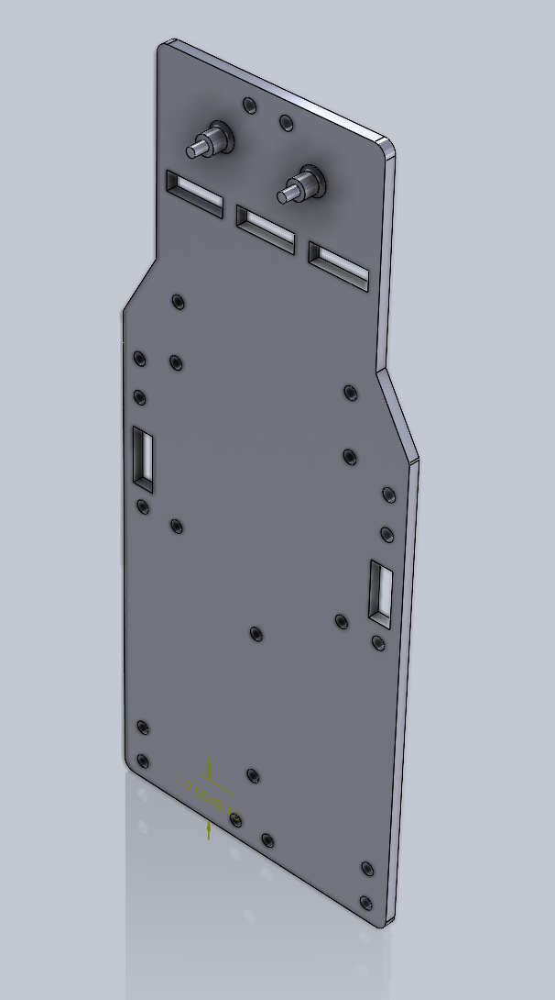

Engineering materials
====

This repository contains engineering materials of a self-driven vehicle's model participating in the WRO Future Engineers competition in the season 2022.

## Content

* `t-photos` contains 2 photos of the team (an official one and one funny photo with all team members)
* `v-photos` contains 6 photos of the vehicle (from every side, from top and bottom)
* `video` contains the video.md file with the link bye video where driving demonstration exists
* `schemes` contains one or several schematic diagrams in form of JPEG, PNG or PDF of the electromechanical components illustrating all the elements (electronic components and motors) used in the vehicle and how they connect to each other.
* `src` contains code of control software for all components which were programmed to participate in the competition
* `models` is for the files for models used by 3D printers, laser cutting machines and CNC machines to produce the vehicle elements. If there is nothing to add to this location, the directory can be removed.
* `other` is for other files which can be used to understand how to prepare the vehicle for the competition. It may include documentation how to connect to a SBC/SBM and upload files there, datasets, hardware specifications, communication protocols descriptions etc. If there is nothing to add to this location, the directory can be removed.

# Our Journey

We are two ambitious engineering students competing in the WRO Future Engineers category for the second year in a row. After our first season, we spent the past year improving our skills in mechanical design, 3D printing, embedded systems, and robotics, aiming to apply everything we had learned.

Our first robot came to life on **May 19, 2026**, powered by an ESP32. Although it could complete the Open Challenge, it still had major issues with steering, power delivery, and the rear axle. Over the following weeks, we redesigned and improved these systems while balancing university exams and projects.

By the local competition on **July 13, 2026**, our robot had evolved significantly. Powered by a Raspberry Pi, it achieved the maximum score in the Open Challenge and earned **second place**, qualifying us for the national competition.

We are proud of our progress, but we know there is still plenty of room for improvement. We look forward to continuing our journey and pushing our robot even further.

## Design Strategy

Our robot is built on a **4WD Arduino RC car chassis**, which we chose as a reliable starting point that allowed us to focus on developing and improving the robot for the WRO Future Engineers competition.

While the kit provided a solid foundation, it also presented several challenges:

* **Limited space** for mounting electronic components, requiring us to carefully redesign the layout and create custom 3D-printed mounts.
* **Minimal assembly documentation**, which led us to reverse-engineer parts of the chassis and solve several mechanical issues during development.

As the project evolved, we continuously modified the original design to better meet the competition's requirements, improving the mechanical structure, electronics integration, and overall reliability.

For future iterations, we plan to redesign the bottom chassis plate to provide additional clearance for the steering mechanism, allowing a greater steering angle and improved maneuverability during the Obstacle Challenge.

# Hardware Design
## Chassis

Our robot is based on the **4WD Arduino RC Car Chassis**, which provided a solid mechanical foundation. However, the original design offered very little space for the electronics required for the competition.

To overcome this limitation, we designed a completely new **top mounting plate** and added an **additional layer** to accommodate all of the robot's electronic components while maintaining a compact and organized layout.

  
   
  <em>Original 4WD Arduino RC Car Chassis used as the base of our robot.</em>

After identifying all the required electronic components and taking precise measurements, we designed a custom mounting plate tailored to our needs. The design went through **four iterations**, with each version improving the placement of components, cable management, and accessibility until we reached the final design.

<table align="center">
  <tr>
    <td align="center">
       
      <em>Early prototype</em>
    </td>
    <td align="center">
       
      <em>Final design</em>
    </td>
  </tr>
</table>

  <em>Middle and top layer plates</em>

