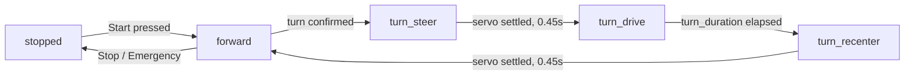

Engineering materials
====

This repository contains engineering materials of a self-driven vehicle's model participating in the WRO Future Engineers competition in the season 2022.

## Content

* `t-photos` contains 2 photos of the team (an official one and one funny photo with all team members)
* `v-photos` contains 6 photos of the vehicle (from every side, from top and bottom)
* `video` contains the video.md file with the link bye video where driving demonstration exists
* `schemes` contains one or several schematic diagrams in form of JPEG, PNG or PDF of the electromechanical components illustrating all the elements (electronic components and motors) used in the vehicle and how they connect to each other.
* `src` contains code of control software for all components which were programmed to participate in the competition
* `models` is for the files for models used by 3D printers, laser cutting machines and CNC machines to produce the vehicle elements. If there is nothing to add to this location, the directory can be removed.
* `other` is for other files which can be used to understand how to prepare the vehicle for the competition. It may include documentation how to connect to a SBC/SBM and upload files there, datasets, hardware specifications, communication protocols descriptions etc. If there is nothing to add to this location, the directory can be removed.


# Our Journey

We are two ambitious engineering students competing in the WRO Future Engineers category for the second year in a row. After our first season, we spent the past year improving our skills in mechanical design, 3D printing, embedded systems, and robotics, aiming to apply everything we had learned.

Our first robot came to life on **May 19, 2026**, powered by an ESP32. Although it could complete the Open Challenge, it still had major issues with steering, power delivery, and the rear axle. Over the following weeks, we redesigned and improved these systems while balancing university exams and projects.

By the local competition on **July 13, 2026**, our robot had evolved significantly. Powered by a Raspberry Pi, it achieved the maximum score in the Open Challenge and earned **second place**, qualifying us for the national competition.

We are proud of our progress, but we know there is still plenty of room for improvement. We look forward to continuing our journey and pushing our robot even further.

## Design Strategy

Our robot is built on a **4WD Arduino RC car chassis**, which we chose as a reliable starting point that allowed us to focus on developing and improving the robot for the WRO Future Engineers competition.

While the kit provided a solid foundation, it also presented several challenges:

* **Limited space** for mounting electronic components, requiring us to carefully redesign the layout and create custom 3D-printed mounts.
* **Minimal assembly documentation**, which led us to reverse-engineer parts of the chassis and solve several mechanical issues during development.

As the project evolved, we continuously modified the original design to better meet the competition's requirements, improving the mechanical structure, electronics integration, and overall reliability.

For future iterations, we plan to redesign the bottom chassis plate to improve the overall structure of the robot. The new design will provide additional clearance for the steering mechanism, enabling a larger steering angle and improved maneuverability during the Obstacle Challenge. Additionally, we aim to make the chassis more modular and accessible, simplifying the assembly and disassembly process while making maintenance and future upgrades easier.
# Hardware Design
## Chassis

Our robot is based on the **4WD Arduino RC Car Chassis**, which provided a solid mechanical foundation, offering rear wheel drive. However, the original design offered very little space for the electronics required for the competition.

To overcome this limitation, we designed a completely new **top mounting plate** and added an **additional layer** to accommodate all of the robot's electronic components while maintaining a compact and organized layout.

<p align="center">
  
  <br>
  <em>Original 4WD Arduino RC Car Chassis used as the base of our robot.</em>
</p>

After identifying all the required electronic components and taking precise measurements, we designed a custom mounting plate tailored to our needs. The design went through **four iterations**, with each version improving the placement of components, cable management, and accessibility until we reached the final design.

<table align="center">
  <tr>
    <td align="center">
      <br>
      <em>Early prototype</em>
    </td>
    <td align="center">
      <br>
      <em>Final design</em>
    </td>
  </tr>
</table>

<p align="center">
  <em>Middle and top layer plates</em>
</p>

## Steering Calibration

One advantage of the chassis kit we used is that it allows adjustments to the steering geometry by changing the lengths of the steering rods. We utilized this flexibility to implement an **Ackermann steering mechanism**, where the inner wheel turns at a greater angle than the outer wheel during cornering.

<p align="center">
  
</p>

This difference in steering angles is necessary because the inner and outer wheels follow different turning radii. The inner wheel travels along a smaller radius, requiring a larger steering angle to ensure that all wheels rotate around the same instantaneous center of rotation.

To determine the required steering angle for **low-speed cornering**, where tire slip can be neglected, we used the following relationship:

```text
δ = atan(L / R)
```

Where:

```text
δ = steering angle of the vehicle centerline
L = wheelbase
R = turning radius
```

For our robot, we measured:

```text
L = 137 mm
R = 525 mm
```

Substituting these values:

```text
δ = atan(137 / 525)
δ = 14.6°
```

After converting the result from radians to degrees, the required steering angle was approximately **15°**.

We then calibrated the steering mechanism by adjusting the steering rods until the wheels achieved the desired Ackermann geometry, with approximately a **15° steering angle** for the centerline turn.

## Mounts

To ensure reliable performance during the competition, important components such as the **Pi Camera** and distance sensors required custom-designed mounts to keep them securely positioned while maintaining accessibility and accuracy.

### ToF Sensor Mount — Initial Design

Our first approach was to use **Time-of-Flight (ToF) sensors** for obstacle detection. After several design iterations, we developed a dedicated mount that provided a stable position and proper alignment for the sensors.

<p align="center">
  
  <br>
  <em>Initial ToF sensor mount design.</em>
</p>

However, during testing, we discovered that ToF sensors were not ideal for the WRO mat environment. Their infrared-based measurements were significantly affected by the absorption properties of black surfaces, reducing their reliability near dark walls and obstacles.

### Ultrasonic Sensor Mount — Final Design

After evaluating different sensor options, we switched to **ultrasonic sensors**, which required a new mounting solution.

<p align="center">
  
  <br>
  <em>Final ultrasonic sensor mount design.</em>
</p>

This design uses a **friction-fit mechanism** to securely hold the sensor in place, eliminating the need for screws while making installation and adjustments faster and easier.

### Pi Camera Mount

The camera is one of the most important components for navigation, requiring a stable and precise mounting position. We designed a dedicated mount that keeps the camera firmly fixed while providing an unobstructed field of view for the lens.

<p align="center">
  
  <br>
  <em>Custom Pi Camera mount positioned at the front of the robot.</em>
</p>

The mount secures the Pi Camera using screws and includes an opening for the lens, ensuring clear vision. The camera is placed at the front of the robot to maximize visibility and improve obstacle detection during autonomous navigation. It is worth noting that the **"SN"** engraved on our mounts refers to our team name, **Sunbird Nomads**.

## 🚀 Software Architecture & Obstacle Strategy

To test and calibrate the robot, we built a live browser dashboard that runs alongside the control code on the Raspberry Pi — showing sensor readings, drive state, and steering in real time, with manual override controls for tuning before autonomous runs.


*The dashboard shown in its idle state — sensor readings populate live once connected to the robot.*

**This is a testing and calibration build for the Open Challenge (Task 1), not our final code** — see [`src/testing/`](src/testing) for the full source and [`src/final/`](src/final) for where the competition version will go.

### Drive state machine

The robot runs as a simple state machine rather than a continuous control loop:



Every phase transition explicitly stops the motor first, moves the servo, waits for it to physically settle, then resumes — this was a deliberate choice over changing steering angle while still driving, since accessories mounted this close to the servo left very little margin for the wheel to catch a mount mid-turn.

### Turn decision — the math

Every ~340 ms sensor cycle, both ultrasonic readings are median-filtered (window of 3, to reject single-sample noise), giving left distance $L$ and right distance $R$ in cm. We compute:

$$\Delta = |L - R|, \qquad r = \frac{\max(L,R)}{\max(\min(L,R),\ 1)}$$

A turn is only considered when:

$$\Delta \geq 35 \text{ cm} \quad \text{OR} \quad (\Delta \geq 20 \text{ cm} \ \text{AND} \ r \geq 1.8)$$

The ratio clause exists because a fixed centimeter threshold alone misses proportionally large gaps at short range — 15 cm vs. 30 cm ($\Delta=15$) is a real opening but falls under a flat 20 cm cutoff, while 20 cm vs. 40 cm ($\Delta=20,\ r=2.0$) clearly should trigger. Combining both catches that case without lowering the flat threshold enough to react to noise.

Even when the threshold is crossed, the robot doesn't turn immediately — it requires **3 consecutive sensor cycles** to agree on the same direction before committing, and at least **1.5 seconds** of forward driving since the last decision. Both are debounce measures: the first against a single noisy reading, the second against immediately re-triggering right after finishing a turn.

Once committed, it's a **timed maneuver, not a sensor-confirmed exit**: stop → steer → drive for a fixed duration → stop → recenter → resume. The turn doesn't end because the sensors say it's clear; it ends because the clock says so. This is simpler and more predictable to tune than closing the loop on sensor feedback, at the cost of needing the timing recalibrated if speed or the track layout changes.

### Steering angle → servo duty cycle

The servo is commanded by PWM duty cycle, mapped linearly from the calibrated angle range:

$$\text{duty}\% = 2.5 + \frac{\theta - 30}{120}\times 10$$

| Position | Angle | Duty cycle |
|---|---|---|
| Left | 81° | 6.75% |
| Center | 106° | 8.83% |
| Right | 131° | 10.92% |

### Safety systems

- **Heartbeat watchdog:** the browser sends a signal once per second; if it's missing for **3 seconds**, the robot force-stops and recenters automatically, whether or not anyone pressed a button.
- **Motor always stops before steering changes** — never commanded to turn and drive in the same instant.
- **Clean shutdown on Ctrl+C / SIGTERM:** stop motor, recenter servo, stop PWM, release GPIO.

### Known constraints (by design, not oversight)

- Speed and distance are **open-loop estimates** — `estimated_speed = max_speed_cm_s × pwm% / 100`, integrated over time. There's no wheel encoder, so these numbers are useful for tuning consistency but aren't ground truth.
- The servo has no position feedback; the dashboard shows the *commanded* angle only, never a measured one.

### Current scope

This logic handles the Open Challenge only. Obstacle Challenge behavior (pillar color detection, avoidance, parking) will be documented here once that code exists.
## 🧭 Systems Thinking & Engineering Decisions

Every version of this robot exists because an earlier version failed at something specific. This section is the honest version of that story — what we planned, what actually happened, and why we changed course each time.


### The plan we started with vs. the robot that actually exists

Early in the season we scoped an ambitious electrical architecture. Most of it didn't survive contact with real hardware — and that's a normal part of engineering, not a failure to hide.

| Subsystem | Original plan | What we're actually running | Why it changed |
|---|---|---|---|
| Motor driver | BTS7960 (high-current) | Generic H-bridge | The simpler driver met our actual current draw with less wiring complexity to debug under deadline |
| Distance sensing | 3× VL53L0X ToF via TCA9548A multiplexer | 1× rear VL53L0X + 2× ultrasonic (left/right) | The multiplexed ToF setup failed to initialize reliably over I²C, *and separately* ToF readings proved unreliable near the mat's black surfaces — two independent reasons pointing the same direction |
| Orientation sensing | MPU6050 IMU | Not present | Cut for now to reduce integration surface while the core drive loop was still being stabilized |
| Power | 3S 18650 pack, dual-pack rotation, BMS, two buck converters (5V logic / 5.5V servo) | Single 12V battery (motor) + USB-C power bank (Pi), servo tapped from the H-bridge's 5V line | Simplified to reduce the number of things that could go wrong while we got the drive loop working; the isolated-rail architecture is still the right long-term answer once time allows |
| Camera | Pi Camera + OpenCV pipeline | Currently excluded | IMX219 hardware fault (`-EREMOTEIO`), unresolved after a full diagnostic pass — see below |

We're not presenting the original plan as a mistake — it was the correct engineering target. What changed is that we chose reliability and debuggability under a real deadline over sophistication we couldn't yet fully verify. That trade-off itself is the point of this section.

### Problems encountered — and what we did about each one

**1. ToF sensors were the wrong tool for this mat, twice over.**
First, the 3-sensor multiplexed setup (TCA9548A, channels 6/7, address 0x70) returned correct model/revision IDs but failed full initialization with I/O errors in both the Adafruit and ST-based drivers — even after we tried an alternate I²C-speed configuration (which we fully reverted after it broke `/dev/i2c-1` entirely). Second, and independently: even a single, correctly-initialized ToF sensor gave IR readings that degraded near the mat's dark regions, since VL53L0X measures time-of-flight of reflected infrared, and black surfaces absorb rather than reflect it. Two unrelated failure modes, same conclusion — we moved side-sensing to ultrasonic, which measures acoustic reflection and doesn't care what color the wall is.

**2. The camera investigation — thorough, and still unresolved.**
The IMX219 previously worked, then disappeared from both Picamera2 and rpicam with `-EREMOTEIO` on register read. We didn't just swap the ribbon and move on:
- Confirmed the Pi model (4B Rev 1.5) and that `dtoverlay=imx219,cam0` was wrong for this connector (probed bus 0 instead of the correct bus)
- Corrected to `dtoverlay=imx219` alone, which correctly probed bus 10 — but still failed at the sensor address
- Checked kernel regulator support (`CONFIG_REGULATOR=y`, `CONFIG_REGULATOR_FIXED_VOLTAGE=y` — both present) and traced that `cam1-reg` enabled, delayed, attempted the read, and disabled only after failing
- Cold-cycled the Pi, reseated and swapped the ribbon end-for-end, disconnected all external GPIO wiring — failure persisted through all of it
- Left with three unproven hypotheses: a physical `CAM_IO0`/sensor-power fault, a ribbon/connector fault, or a software timing regression — and a specific next diagnostic (a Device Tree overlay forcing `cam1-reg` always-on, then a delayed reprobe) that we haven't run yet

We're documenting the dead ends deliberately. A repo that only shows what worked hides the process; this is the process.

**3. A live wiring mistake, caught before it became a bigger one.**
One ultrasonic module was briefly connected with VCC and GND reversed and started warming up. It was disconnected immediately, rewired correctly, and returned valid readings afterward — but we're still inspecting it for renewed heating before trusting it long-term. This is also why "common ground across every sub-circuit" is called out as a hard rule everywhere else in this README: it's not theoretical caution, it came from a real near-miss.

### The pattern across all three

In every case, the fix was to reduce complexity rather than push through it: fewer sensors on a shared bus instead of debugging a flaky multiplexer, ultrasonic instead of fighting IR reflectivity, a documented pause on the camera instead of an undiagnosed intermittent fault riding along into competition. None of these are permanent decisions — they're the right calls *for where we are in the season*, and each one is written down specifically so we (or anyone reproducing this robot) knows which trade-offs are still open to revisit.
