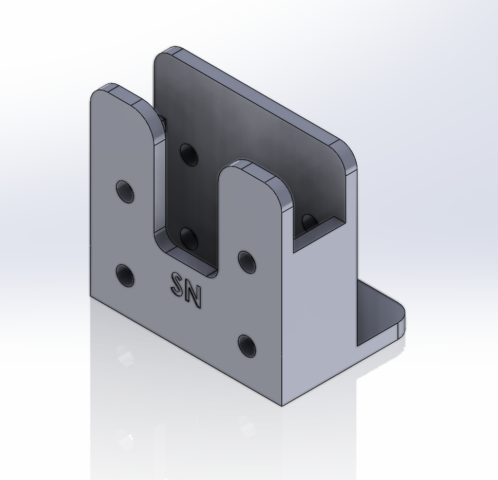
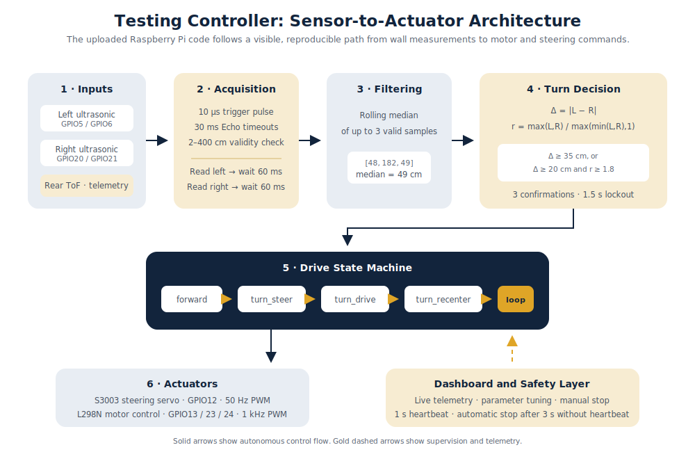
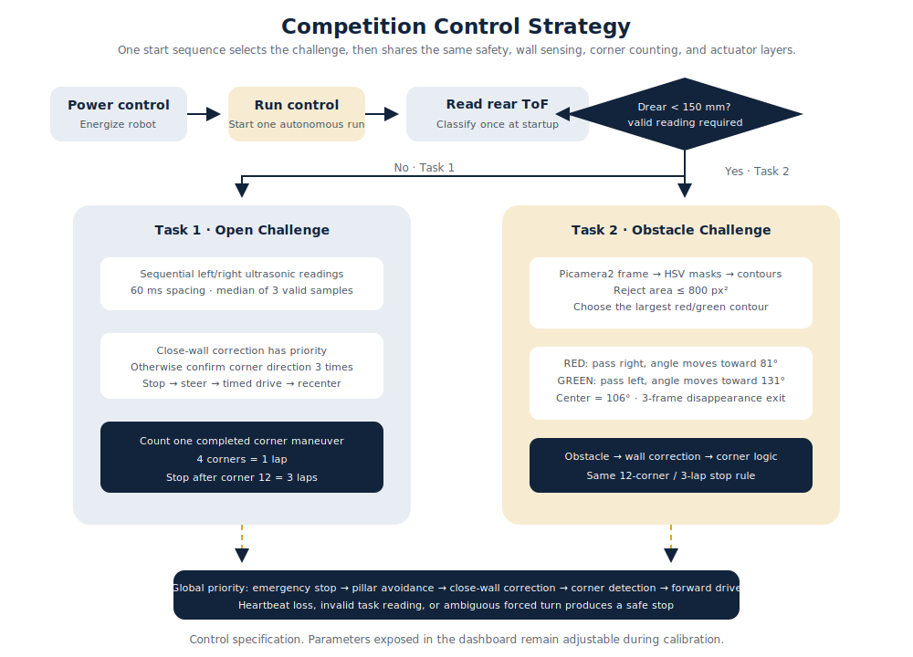
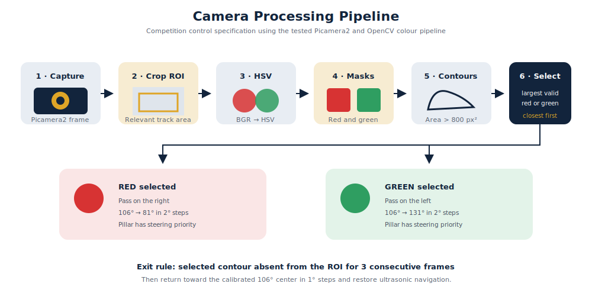
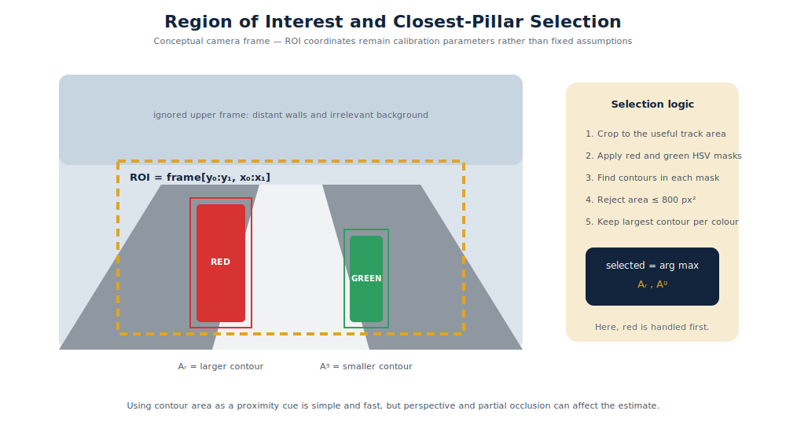
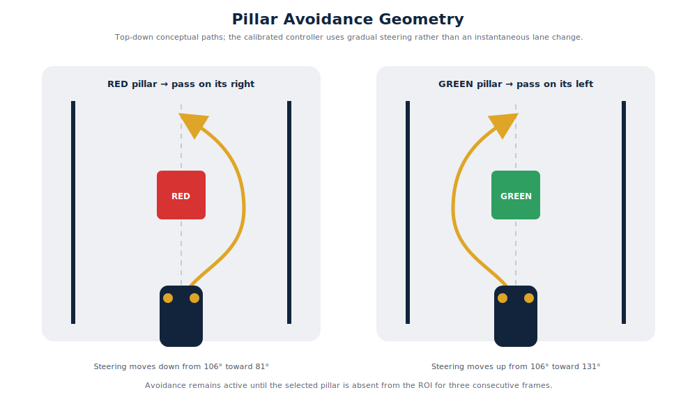
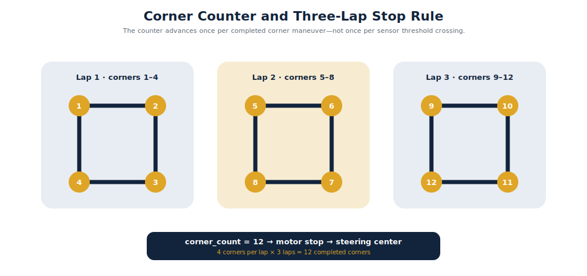
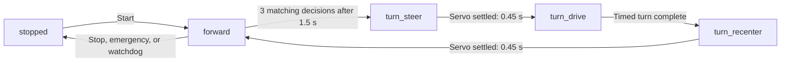

<h1 align="center">Sunbird Nomads</h1>

<h3 align="center">
WRO 2026 Future Engineers · Palestine 🇵🇸
</h3>

<p align="center">
  
</p>

<p align="center">
An autonomous vehicle engineered through testing, failure, redesign, and continuous improvement.
</p>

---

##  Repository Contents

| Folder | Contents |
|---|---|
| [`t-photos/`](t-photos/) | Official and informal team photos |
| [`v-photos/`](v-photos/) | Vehicle photographs from every required angle |
| [`video/`](video/) | Driving demonstration videos |
| [`schemes/`](schemes/) | Electrical and wiring diagrams |
| [`src/`](src/) | Testing and final robot software |
| [`models/`](models/) | 3D-printing and CAD files |
| [`docs/`](docs/) | Engineering diagrams and detailed investigations |

---
##  Why “Sunbird Nomads”?

<p align="center">
  
</p>

The **Palestine sunbird** is a small, colourful bird native to our region and recognized as the national bird of Palestine. For Palestinians, it represents our land, identity, freedom, and resilience.

The word **Nomads** reflects our engineering journey constantly exploring, adapting, learning, and moving toward better solutions.

Together, **Sunbird Nomads** represents a Palestinian team deeply rooted in its homeland while continuing to move forward and discover new possibilities.

---
## Our Journey

We are **Alma Alkhader** and **Sara Afifi**, two second-year engineering students at Birzeit University brought together by a shared interest in robotics. This is our second year competing in the WRO Future Engineers category. Our experience began with our [WRO 2025 BiruniVerse project](https://github.com/AlmaAlkhader/WRO2025-BiruniVerse), where we gained our first practical experience designing, building, and programming an autonomous vehicle.

###  Meet the Team

<table>
  <tr>
    <th width="50%">Alma Alkhader</th>
    <th width="50%">Sara Afifi</th>
  </tr>
  <tr>
    <td align="center">
      
    </td>
    <td align="center">
      
    </td>
  </tr>
  <tr>
    <td valign="top">
      <strong>Occupation:</strong> Computer Engineering student<br><br>
      <strong>Academic level:</strong> Second year<br><br>
      <strong>Membership:</strong> IEEE Robotics and Automation Society (RAS), Birzeit University Student Branch<br><br>
      <strong>Interest:</strong> Robotics and autonomous systems<br><br>
      <strong>Team responsibilities:</strong> Power system, electronics, wiring, sensor integration, Raspberry Pi setup, and control software
    </td>
    <td valign="top">
      <strong>Occupation:</strong> Mechanical Engineering student<br><br>
      <strong>Academic level:</strong> Second year<br><br>
      <strong>Membership:</strong> Technical member of IMechE at Birzeit University<br><br>
      <strong>Specialization:</strong> Mechanical design and manufacturing<br><br>
      <strong>Team responsibilities:</strong> Chassis development, steering mechanism, component placement, measurements, and custom-designed mounts
    </td>
  </tr>
</table>

Our different specializations allowed us to approach the robot from two connected perspectives. Alma concentrated on making the electronics and software work reliably, while Sara focused on ensuring that the mechanical design could support those systems and move effectively. Nearly every improvement required both sides to work together.

<p align="center">
  
  <br>
  <em>Two specializations developed together through every prototype, redesign, and milestone.</em>
</p>

Our first robot of the 2026 season came to life on **May 19, 2026**, powered by an ESP32. Although it completed the Open Challenge, it still faced major issues with steering, power delivery, and the rear axle. Over the following weeks, we redesigned and improved these systems while balancing the project with our university exams and coursework.

By the local competition on **July 13, 2026**, the robot had evolved significantly. After moving from the ESP32 to a Raspberry Pi and making several mechanical and electrical improvements, it achieved the maximum score in the Open Challenge. We earned **second place** and qualified for the national competition.

We are proud of how far the robot has come. Every test, mistake, and redesign contributed to the final architecture documented in this repository.

## Design Strategy

Our robot is built on a **4WD Arduino RC car chassis**, which we chose as a reliable starting point that allowed us to focus on developing and improving the robot for the WRO Future Engineers competition.

While the kit provided a solid foundation, it also presented several challenges:

* **Limited space** for mounting electronic components, requiring us to carefully redesign the layout and create custom 3D-printed mounts.
* **Minimal assembly documentation**, which led us to reverse-engineer parts of the chassis and solve several mechanical issues during development.

As the project evolved, we continuously modified the original design to better meet the competition's requirements, improving the mechanical structure, electronics integration, and overall reliability.

# Hardware Design
## Mobility and Mechanical Design

The mechanical system uses a conventional car layout: a **single rear drive axle** provides forward and reverse motion, while an **S3003 servo** steers the two front wheels through linkages. This layout satisfies the WRO requirement for a four-wheeled vehicle with one driving axle and one steering actuator, and it behaves more like a road car than a differential-drive robot.

### Chassis and Drive Layout

Our robot is based on the [**RoboticX 4WD RC Smart Car Chassis with S3003 Servo and Bearing Kit**](https://roboticx.ps/product/4wd-rc-smart-car-chassis-with-s3003-metal-servo-bearing-kit-for-arduino/). 
We selected the kit as a reliable mechanical starting point, but we did not keep its original component layout. Its acrylic plate had limited usable space and mounting holes intended mainly for an Arduino. Our Raspberry Pi, power system, camera, motor controller, and sensors required a new structure, so we designed a custom middle plate and an upper electronics layer.

<p align="center">
  
  <br>
  <em>Original chassis before adding the custom two-level electronics structure.</em>
</p>

### Final Vehicle Dimensions

| Dimension | Final value | How it was obtained | Why it matters |
|---|---:|---|---|
| Overall length | 248 mm | Measured vehicle length; also matches the chassis listing | Determines WRO envelope margin and parking-space length |
| Chassis width | 146 mm | Published chassis width | Determines lateral clearance and field-centering geometry |
| Assembled height | 126 mm | Measured with the upper electronics layer installed | Confirms that the two-level design remains inside the height limit |
| Wheelbase | 137 mm | Measured axle-to-axle distance | Used in steering-angle calculations |
| Front track width | 117 mm | Measured between the front wheel centerlines | Used to calculate different inner and outer steering angles |
| Wheel diameter | 64 mm | Published wheel diameter | Determines distance travelled per wheel revolution |
| Ground clearance | 19 mm | Measured from the ground to the lowest chassis surface | Reduces the chance of the plate catching on small field irregularities |

<p align="center">
  
  <br>
  <em>Final dimensions, WRO size margins, wheel travel, and parking-space calculations.</em>
</p>

The [WRO 2026 rules](https://wro-association.org/wp-content/uploads/WRO-2026-Future-Engineers-Self-Driving-Cars-General-Rules.pdf) limit the vehicle to **300 × 200 mm** and **300 mm in height**. Comparing the final robot with that envelope gives:

```text
Length margin = 300 − 248 = 52 mm
Width margin  = 200 − 146 = 54 mm
Height margin = 300 − 126 = 174 mm
```

These are total envelope margins. They show that the second electronics layer and sensor mounts remain within the dimensional limit without requiring parts to be removed before inspection.


### Field-Centering and Parking Geometry

During setup, we established the robot's centerline by measuring from the track walls to the midpoint of the vehicle. For a corridor width $W_t$, a centered robot midpoint is:

$$d_{mid}=\frac{W_t}{2}$$

The open challenge may use a **1000 mm** or **600 mm** corridor, while the obstacle challenge uses a **1000 mm** corridor. The nominal midpoint references are therefore:

| Nominal corridor width | Wall-to-midpoint reference | Side clearance with a 146 mm robot |
|---:|---:|---:|
| 1000 mm | 500 mm | $(1000-146)/2=427$ mm per side |
| 600 mm | 300 mm | $(600-146)/2=227$ mm per side |

The WRO rules allow dimensional tolerance in the field, so these values define the geometry rather than a single inflexible sensor threshold.

For the obstacle challenge, the parking space is **200 mm wide**, and its length is $1.5$ times the vehicle length:

```text
Parking length = 1.5 × 248 = 372 mm
Longitudinal allowance = 372 − 248 = 124 mm
Lateral allowance = 200 − 146 = 54 mm
Centered lateral allowance = 54 / 2 = 27 mm per side
```

The remaining **VL53L0X ToF sensor is mounted at the rear** and is used to monitor the final rear clearance during parking. Its job is separate from the left and right ultrasonic sensors used for wall sensing.

### Custom Plate Development

After identifying the required components, we designed custom middle and top plates to increase usable mounting area while preserving access to wiring and controls. The plate design went through **four physical iterations**. Our initial measurements were not accurate enough to produce a correct fit on the first attempt, so every printed version was installed on the real chassis, checked, remeasured, and revised.

<table align="center">
  <tr>
    <td align="center">
      <br>
      <em>Early prototype</em>
    </td>
    <td align="center">
      <br>
      <em>Final design</em>
    </td>
  </tr>
</table>

<p align="center">
  
  <br>
  <em>The physical fit test converted measurement errors into specific CAD corrections.</em>
</p>

The process was not simply “print until it looks right.” Each loop checked whether components fitted without interference, whether cables could reach without being sharply bent, whether switches remained accessible, and whether the camera and sensors had an unobstructed view. Repeating the cycle improved component placement, cable management, and service access.

### 3D-Printing Configuration

The final plates were produced by FDM printing on an **ELEGOO Centauri Carbon** using **Rapid PETG**. ELEGOO lists PETG as a supported material and specifies a **0.1–0.4 mm** layer-height range for this printer; our **0.12 mm** setting is near the fine-detail end of that range.

| Setting | Final value | Engineering purpose |
|---|---:|---|
| Printer | ELEGOO Centauri Carbon | Enclosed CoreXY FDM printer used for the final plates |
| Material | Rapid PETG | Tougher functional material for plates handled and reassembled repeatedly |
| Layer height | 0.12 mm | Finer vertical resolution and more controlled fit, at the cost of longer print time |
| Wall loops | 3 | Adds perimeter stiffness around the plate edges and mounting holes |
| Sparse infill pattern | Gyroid | Distributes internal support in multiple directions without using solid infill everywhere |
| Sparse infill density | 25% | Balances rigidity, material use, mass, and print time |

Compared with the printer's commonly recommended **0.20 mm** layer height, a 0.12 mm layer produces approximately:

$$\frac{0.20}{0.12}=1.67$$

or **67% more layers for the same part height**. We accepted the longer printing time because dimensional fit and clean mount features were more important than minimum production time for the final plates.

Printer reference: [ELEGOO Centauri Carbon specifications](https://eu.elegoo.com/en-be/products/centauri-carbon).

## Steering Calibration

The chassis allows the steering-rod lengths to be adjusted. We used this to approximate **Ackermann steering**, where the inner front wheel turns more sharply than the outer front wheel because the two wheels follow different radii around the same instantaneous center of rotation.

<p align="center">
  
  <br>
  <em>Animated steering geometry for an illustrative 200 mm turn radius. The 44° inner and 28° outer angles are calculated from our measured wheelbase and front track.</em>
</p>

<p align="center">
  
</p>

For low-speed cornering, the centerline steering angle is:

$$\delta=\tan^{-1}\left(\frac{L}{R}\right)$$

Using the measured wheelbase $L=137$ mm and turning radius $R=525$ mm:

$$\delta=\tan^{-1}\left(\frac{137}{525}\right)=14.6^\circ\approx15^\circ$$

The measured front track width $t=117$ mm lets us estimate the ideal inner and outer wheel angles:

$$\delta_{in}=\tan^{-1}\left(\frac{L}{R-t/2}\right)
=\tan^{-1}\left(\frac{137}{525-58.5}\right)=16.4^\circ$$

$$\delta_{out}=\tan^{-1}\left(\frac{L}{R+t/2}\right)
=\tan^{-1}\left(\frac{137}{525+58.5}\right)=13.2^\circ$$

| Steering reference | Calculated angle |
|---|---:|
| Vehicle centerline | 14.6° |
| Inner front wheel | 16.4° |
| Outer front wheel | 13.2° |
| Inner-to-outer difference | 3.2° |

We adjusted the steering rods until the wheels followed this geometry as closely as the kit mechanism allowed. This reduces tire scrub compared with forcing both front wheels to the same angle.

## Mounts

The camera and distance sensors use custom-designed mounts so their position does not change during a run while remaining accessible for maintenance.

### ToF Sensor Mount — Initial Design and Final Rear Use

Our first approach used multiple Time-of-Flight sensors for wall sensing. After several design iterations, we produced a stable ToF mount.

<p align="center">
  
  <br>
  <em>ToF sensor mount design.</em>
</p>

Testing showed that ToF sensors were not suitable as our main wall sensors on the WRO mat because infrared return varied with dark surfaces and target geometry. We replaced the side-facing ToF plan with ultrasonic wall sensing. **One VL53L0X remains mounted on the back of the vehicle for short-range parking alignment.**

### Ultrasonic Sensor Mount — Final Design

The left and right ultrasonic sensors required a different mount that kept both transducers clear of the chassis.

<p align="center">
  
  <br>
  <em>Final ultrasonic sensor mount design.</em>
</p>

The mount uses a **friction-fit mechanism** to hold the sensor without screws. This makes installation and replacement fast, but it also made print accuracy important: an undersized opening could damage the board, while an oversized opening allowed the sensor angle to change.

### Pi Camera Mount

The camera requires a stable, repeatable position because a change in height or angle changes the apparent location of the traffic pillars. We designed a screw-mounted holder with an unobstructed lens opening.

<p align="center">
  
  <br>
  <em>Custom camera mount on the second level at the front of the robot.</em>
</p>

The camera is installed vertically on the second level, facing forward with its optical axis approximately parallel to the field. The **“SN”** engraving identifies the mount as a Sunbird Nomads part.

# Power & Sensor Architecture

Our electrical design separates the noisy, high-current drive system from the Raspberry Pi's processing supply. A three-cell motor battery powers the H-bridge, drive motor, and steering-servo rail, while a dedicated USB power bank powers the Raspberry Pi 4 and camera. The two sources share a common ground so that the Raspberry Pi's control signals have the same electrical reference as the H-bridge and servo.

This section uses the robot's confirmed configuration, values recovered from our project records, and manufacturer specifications. No unrecorded measurement is presented as a test result.

## Main Electrical Components

<table align="center">
  <tr>
    <td align="center" width="33%">
      <br>
      <strong>3 × 18500 Li-ion cells</strong><br>
      <sub>3.7 V, 2250 mAh per cell</sub>
    </td>
    <td align="center" width="33%">
      <br>
      <strong>L298N motor controller</strong><br>
      <sub>Purchased separately from the chassis</sub>
    </td>
    <td align="center" width="33%">
      <br>
      <strong>S3003 servo + 25 mm gearmotor</strong><br>
      <sub>Supplied with the RoboticX chassis</sub>
    </td>
  </tr>
</table>

<p align="center">
  <sub>Component sources: team battery record and the RoboticX <a href="https://roboticx.ps/product/dual-motor-controller-module-l298n/">L298N</a> and <a href="https://roboticx.ps/product/4wd-rc-smart-car-chassis-with-s3003-metal-servo-bearing-kit-for-arduino/">chassis-kit</a> listings.</sub>
</p>

## System Architecture

<p align="center">
  
  <br>
  <em>Confirmed power paths, connected loads, control signals, and shared ground.</em>
</p>

The power switch energizes the drive system. A separate start control launches the autonomous program, allowing the robot to be powered and checked before motion begins.

## Power Sources and Distribution

| Source or rail | Connected loads | Confirmed information |
|---|---|---|
| 3S motor pack | L298N H-bridge, drive motor, servo rail | 3 × 18500 Li-ion cells, each labelled 3.7 V and 2250 mAh |
| USB power bank | Raspberry Pi 4, camera, and Pi-side sensors | Billboard 10,000 mAh, 5 V / 3 A output |
| L298N motor output | 25 mm all-metal gearmotor | PWM speed and direction control |
| H-bridge module 5 V terminal | S3003 steering servo | Servo power and ground; control signal from Raspberry Pi GPIO12 |
| Raspberry Pi 3.3 V and GPIO | Ultrasonic and ToF sensor logic | Common ground through the breadboard negative rail |

The Raspberry Pi 4 requires a good-quality **5 V, 3 A** USB-C supply according to its [official datasheet](https://pip.raspberrypi.com/documents/RP-008341-DS-raspberry-pi-4-datasheet.pdf). The power bank's labelled output matches that supply requirement.

### 3S Motor-Battery Calculation

The cells are connected in series. Series connection adds voltage, but it does **not** add ampere-hour capacity:

```text
Nominal pack voltage = 3 × 3.7 V = 11.1 V
Fully charged voltage = 3 × 4.2 V = 12.6 V
Pack capacity = 2.25 Ah
Nominal stored energy = 11.1 V × 2.25 Ah = 24.975 Wh ≈ 25.0 Wh
```

The 3S pack therefore supplies approximately **12.6 V when fully charged** and **11.1 V at nominal charge**. The voltage reaching the motor is lower because the L298N has an internal voltage drop.

### H-Bridge Trade-off and Voltage Loss

The installed driver is the separately purchased [**RoboticX L298N dual motor-controller module**](https://roboticx.ps/product/dual-motor-controller-module-l298n/). Its seller specifications list a **6–15 V motor-supply range**, **4.5–5.5 V logic range**, **2 A maximum drive current**, and **0–100% output duty cycle**.

The [STMicroelectronics L298 datasheet](https://www.st.com/resource/en/datasheet/l298.pdf) specifies a total bridge saturation-voltage drop of approximately **1.8 V typical and up to 3.2 V at 1 A**. At a nominal 11.1 V pack voltage:

```text
Motor voltage ≈ battery voltage − bridge drop
Best reference case: 11.1 V − 1.8 V = 9.3 V
High-drop case:      11.1 V − 3.2 V = 7.9 V
```

The corresponding driver heat at 1 A is approximately:

```text
Driver loss = current × voltage drop
             = 1 A × (1.8 to 3.2 V)
             = 1.8 to 3.2 W
```

This older bipolar driver is simple and readily available, but it sacrifices motor voltage and produces more heat than a modern MOSFET driver. We retained it because it was already integrated and provided the required PWM speed and direction control.

## Documented Electrical Load Data

| Load | Supply | Datasheet or seller value | Why it matters |
|---|---:|---|---|
| Raspberry Pi 4 system | 5 V | 3 A recommended supply capability | Establishes the required continuous output of the USB power bank and cable |
| Left HC-SR04-type sensor | Installed at 3.3 V | Standard HC-SR04 reference: 15 mA at 5 V | Distinguishes the installed working configuration from the standard module specification |
| Right HC-SR04-type sensor | Installed at 3.3 V | Standard HC-SR04 reference: 15 mA at 5 V | Uses the same supply and reference as the left sensor |
| Rear VL53L0X | Raspberry Pi sensor rail | Bare sensor: 19 mA typical active and up to 40 mA peak | Accounts for the parking sensor's load on the Pi-side rail |
| L298N motor controller | 3S motor pack | 6–15 V motor supply, 4.5–5.5 V logic, and 2 A maximum drive current | Confirms compatibility with the motor pack and defines the controller's published current limit |

Sources: [Raspberry Pi 4 datasheet](https://pip.raspberrypi.com/documents/RP-008341-DS-raspberry-pi-4-datasheet.pdf), [HC-SR04 reference sheet](https://cdn.sparkfun.com/datasheets/Sensors/Proximity/HCSR04.pdf), [STMicroelectronics VL53L0X datasheet](https://www.st.com/resource/en/datasheet/vl53l0x.pdf), and [RoboticX L298N product page](https://roboticx.ps/product/dual-motor-controller-module-l298n/).

The power sources are intentionally separated: the 3S pack handles drive and steering loads, while the USB power bank isolates the Raspberry Pi and vision system from motor-current transients.

## Signal and GPIO Map

| Device | Function | BCM GPIO | Physical pin | Interface |
|---|---|---:|---:|---|
| Left ultrasonic | Trigger | GPIO5 | 29 | Digital output |
| Left ultrasonic | Echo | GPIO6 | 31 | Digital input |
| Right ultrasonic | Trigger | GPIO20 | 38 | Digital output |
| Right ultrasonic | Echo | GPIO21 | 40 | Digital input |
| Rear VL53L0X | SDA | GPIO2 | 3 | I²C data |
| Rear VL53L0X | SCL | GPIO3 | 5 | I²C clock |
| Steering servo | PWM signal | GPIO12 | 32 | 50 Hz PWM |
| H-bridge enable | Motor speed | GPIO13 | 33 | 1 kHz PWM |
| H-bridge IN1 | Motor direction | GPIO23 | 16 | Digital output |
| H-bridge IN2 | Motor direction | GPIO24 | 18 | Digital output |

All grounds are joined on the breadboard negative rail. This common reference is necessary because the Pi sends control signals to devices powered from the motor-side supply.

## Sensor Roles, Selection, and Placement

| Sensor | Final role | Why it was selected | Main limitation |
|---|---|---|---|
| Left ultrasonic | Measure distance to the left wall and detect openings | Measures by reflected sound, so wall colour has much less influence than on optical ranging | Wide beam can reflect from angled surfaces; can cross-talk with another ultrasonic sensor |
| Right ultrasonic | Measure distance to the right wall and detect openings | Same device type on both sides simplifies comparison and replacement | Requires timing separation and has a 2 cm reference blind zone |
| Rear VL53L0X ToF | Short-range parking alignment | Narrower optical field of view is useful for alignment with the rear parking boundary | Infrared return can depend on target reflectance, angle, and cover-glass crosstalk |
| Arducam 12 MP IMX708 | Detect red and green traffic pillars | High-resolution colour frames support HSV segmentation and pillar-position estimation | Processing full-resolution frames increases latency; fixed focus reduces near-field sharpness |

### Distance-Sensor Reference Photos

<table align="center">
  <tr>
    <td align="center" width="50%">
      <br>
      <strong>2 × HC-SR04-type ultrasonic sensors</strong><br>
      <sub>Left and right wall sensing</sub>
    </td>
    <td align="center" width="50%">
      <br>
      <strong>1 × VL53L0X ToF sensor</strong><br>
      <sub>Rear parking-distance sensing</sub>
    </td>
  </tr>
</table>

<p align="center">
  <sub>Reference images: <a href="https://instock.pk/hc-sr04-ultrasonic-sensor-distance-measuring-module.html">HC-SR04</a> and <a href="https://store.fut-electronics.com/products/vl53l0x-time-of-flight-sensor-precision-distance-measurements">VL53L0X module</a>.</sub>
</p>

The ultrasonic sensors face left and right so that each one has a direct line of sight to one track wall. This placement supports wall-distance comparison and exposes the sudden open-space reading used to identify corners. The rear-facing ToF sensor is separated from this navigation pair because its role is parking clearance rather than turn detection.

<p align="center">
  
  <br>
  <em>Conceptual top view showing each sensor's direction and role; component positions are not dimensioned.</em>
</p>

The rear ToF sensor is used specifically for **parking**, not front obstacle detection. It measures the remaining rear clearance during the final parking maneuver.

### Placement Constraints from Field Geometry

The [WRO 2026 Future Engineers rules](https://wro-association.org/wp-content/uploads/WRO-2026-Future-Engineers-Self-Driving-Cars-General-Rules.pdf) define physical targets that directly affect sensor placement:

| Field feature | Rule dimension | Design consequence |
|---|---:|---|
| Interior and exterior walls | 100 mm high | The ultrasonic acoustic center should remain below the wall top and clear of wheels/mounts |
| Traffic pillars | 50 × 50 × 100 mm | Camera resolution must preserve a useful contour for a 50 mm-wide target at the required detection distance |
| Parking boundary elements | 200 × 20 × 100 mm | Rear ToF line of sight must intersect the 100 mm-high element during parking |
| Maximum vehicle envelope | 300 × 200 × 300 mm | Camera and sensor mounts must remain inside the permitted footprint and height |
| Obstacle Challenge track width | 1000 ± 10 mm | Side ranges must cover the relevant wall distance while leaving margin for turns and openings |

The HC-SR04 reference datasheet lists a **15° measuring angle**. Approximating this as a conical beam, its footprint width at target distance $d$ is:

$$W_{US}=2d\tan(15^\circ/2)$$

| Target distance | Approximate ultrasonic footprint width |
|---:|---:|
| 20 cm | 5.3 cm |
| 50 cm | 13.2 cm |
| 100 cm | 26.3 cm |

Ultrasonic sensors detect objects across a wide area, so they may sometimes pick up nearby wheels, mounts, corners, or angled walls instead of the intended wall. The rear VL53L0X sensor observes a smaller area, making it more suitable for precise parking-distance measurements.

### Ultrasonic Timing and Crosstalk Control

The standard HC-SR04 datasheet recommends a measurement cycle longer than **60 ms**. Our code does not trigger both sensors together: it reads the left sensor, waits **60 ms**, then reads the right sensor. Sequential triggering reduces the chance that one receiver mistakes the other sensor's sound burst for its own echo.

The control loop also applies a three-sample median filter. A median rejects one isolated high or low reading without being shifted as strongly as a mean:

```text
Filtered distance = median(last three valid readings)
```

This filtering and delay improve robustness at the cost of a slower sensing update. The dashboard therefore prioritizes stable wall readings over maximum update rate.

### HC-SR04 Voltage Configuration

The installed ultrasonic sensors operate when powered from **3.3 V**, and no Echo voltage divider is used. This is the robot's observed configuration. The commonly published HC-SR04 reference sheet instead specifies **5 V operation**, while Raspberry Pi GPIO uses a **3.3 V I/O rail**. For that reason, this repository does not generalize the robot's observed 3.3 V behaviour to every HC-SR04 board revision.

## Camera Hardware and Colour Pipeline

The installed camera is an **Arducam 12 MP IMX708 fixed-focus HDR camera**. Arducam specifies a maximum sensor resolution of **4608 × 2592**, a 1.4 µm pixel size, and a fixed-focus range listed as 1.5 m to infinity for this module family in its [IMX708 documentation](https://docs.arducam.com/Raspberry-Pi-Camera/Native-camera/12MP-IMX708/). The camera is used for colour detection rather than full-resolution recording.

The existing colour-detection program uses **Picamera2** for capture and **OpenCV** for BGR-to-HSV conversion and contour detection. The currently recorded code values are:

| Parameter | Current code value |
|---|---|
| Green HSV lower bound | `[115, 200, 100]` |
| Green HSV upper bound | `[160, 255, 180]` |
| Red HSV lower bound | `[0, 80, 60]` |
| Red HSV upper bound | `[30, 255, 255]` |
| Minimum contour area | `800 px²` |
| Loop delay | `0.05 s` |

Picamera2 is the Python interface to Raspberry Pi's `libcamera`-based camera stack, as described in the [official Raspberry Pi camera documentation](https://www.raspberrypi.com/documentation/computers/camera_software.html). The new camera is producing colour detections with the recorded OpenCV pipeline.

## Recorded Integration Observations

These are the exact values retained from earlier individual hardware checks. They confirm communication, but the true target distances were not recorded, so they cannot be used to claim accuracy.

| Device | Recorded observation | What it proves | What it does not prove |
|---|---:|---|---|
| VL53L0X | 159 mm, followed by changing readings | I²C initialization and live ranging worked | Accuracy, parking repeatability, or surface independence |
| Left ultrasonic | Approximately 47–49 cm | Trigger/Echo path returned plausible changing data | Error at a known distance or invalid-reading rate |
| Right ultrasonic | 8.9 cm | Individual sensor read worked at short range | Cross-sensor consistency or calibrated accuracy |

## Failure-Point Analysis

| Failure mode | Effect on robot | Current design response |
|---|---|---|
| Two ultrasonic bursts overlap | False wall distance and incorrect turn decision | Sensors are triggered sequentially with 60 ms separation and a median-of-three filter |
| L298N voltage drop | Reduced motor voltage and power lost as heat | The loss is calculated above and the robot uses conservative PWM settings |
| Motor electrical noise reaches processing electronics | Sensor errors or controller reset | The Raspberry Pi and camera use a separate USB power bank while all control signals retain a common ground reference |
| Camera colour shifts | Missed or incorrect pillar classification | HSV bounds are combined with an 800 px² contour-area threshold |
| Ultrasonic VCC/GND reversed | Sensor heating and possible damage | The earlier incident was stopped immediately; common-rail wiring and pin checks were adopted afterward |
| Unprotected 3S cell pack is overcharged, over-discharged, imbalanced, or shorted | Cell damage, heating, fire risk, or sudden shutdown | The pack has a physical isolation switch, but no BMS or fuse is installed |

The switch is useful for isolation, but it is **not** a substitute for a battery-management/protection circuit or fuse. The absence of a BMS and overcurrent protection is the highest-priority electrical risk in the current design.

## 🚀 Software Architecture & Obstacle Strategy

The uploaded Raspberry Pi program is a **testing and calibration controller for the Open Challenge**. It combines wall-distance sensing, a deterministic drive state machine, actuator control, live telemetry, and emergency-stop supervision in one inspectable system.

<p align="center">
  
  <br>
  <em>Control flow in the uploaded testing controller. The rear ToF is displayed as telemetry; it does not influence the current turn decision.</em>
</p>

### Software Evidence in This Repository

| File | Responsibility |
|---|---|
| [`src/testing/dashboard.py`](src/testing/dashboard.py) | GPIO setup, sensor acquisition, filtering, turn decisions, state machine, motor/servo commands, watchdog, and HTTP API |
| [`src/testing/dashboard.html`](src/testing/dashboard.html) | Live sensor/state display and calibration controls |
| [`src/testing/README.md`](src/testing/README.md) | Wiring, installation, launch procedure, safety notes, and known limitations |

The repository does **not** currently contain a `src/final/` competition controller or the camera-based red/green pillar-avoidance program. The obstacle hardware is documented above, but this section does not claim obstacle behavior that cannot be reproduced from the uploaded source.

### Dashboard and Competition-Control Visuals

The dashboard image is evidence from the uploaded calibration interface. The remaining diagrams document the **agreed competition control specification**: rear-ToF task selection at 150 mm, camera priority during Task 2, red/green avoidance, and stopping after twelve completed corners. They do not claim an autonomous final-parking routine.

<table align="center">
  <tr>
    <td align="center" width="45%">
      <br>
      <strong>Calibration dashboard</strong><br>
      <sub>Live telemetry, steering, speed, timing, and safety controls</sub>
    </td>
    <td align="center" width="55%">
      <br>
      <strong>Competition control specification</strong><br>
      <sub>Task selection, behavior priority, corner counting, and stop condition</sub>
    </td>
  </tr>
</table>

#### Camera Processing and ROI

<p align="center">
  
  <br>
  <em>Frame processing from ROI crop through HSV masks, contour filtering, colour selection, and steering.</em>
</p>

<p align="center">
  
  <br>
  <em>The ROI removes irrelevant image regions. If both colours appear, the largest accepted contour is treated as the closest obstacle.</em>
</p>

#### Red and Green Avoidance Geometry

<p align="center">
  
  <br>
  <em>Red is passed on the right; green is passed on the left. Avoidance ends after the selected pillar is absent from the ROI for three consecutive frames.</em>
</p>

#### Corner and Lap Counting

<p align="center">
  
  <br>
  <em>One completed corner maneuver increments the counter. Four corners form one lap, and the robot stops after corner twelve.</em>
</p>

### Control Flow

The robot uses explicit states instead of mixing sensing, steering, and motor commands in one loop:



| Current state | Exit condition | Action before next state |
|---|---|---|
| `stopped` | Start command | Center steering, begin a new section, drive forward |
| `forward` | Same turn candidate confirmed 3 times after the 1.5 s lockout | Stop motor and command the calibrated turn angle |
| `turn_steer` | 0.45 s settling time expires | Drive forward at the turn-speed setting |
| `turn_drive` | Configured turn duration expires | Stop motor and command center steering |
| `turn_recenter` | 0.45 s settling time expires | Begin the next forward section |
| Any active state | Stop, emergency stop, or heartbeat older than 3 s | Stop motor and recenter steering |

Stopping the drive motor before changing steering reduces the chance of a wheel catching a nearby mount. The trade-off is time: with the default 1.0 s turn, a complete turn sequence includes approximately **0.9 s of stationary servo-settling time** in addition to the driven turn.

### Sensor Acquisition and Noise Rejection

Each HC-SR04-type reading follows the same guarded sequence:

1. Reject an Echo pin that is already stuck HIGH.
2. Send a **10 µs** Trigger pulse.
3. Apply a **30 ms** timeout while waiting for the echo to start and another timeout while waiting for it to finish.
4. Convert pulse width to distance with $d=t\times17{,}150$ cm.
5. Accept only readings between **2 cm and 400 cm**.
6. Keep a rolling median of up to three valid samples.

The left and right sensors are fired sequentially with a **60 ms delay after each reading**, reducing ultrasonic crosstalk. A three-sample median rejects a single outlier:

```text
Raw samples:      [48, 182, 49] cm
Median-filtered:  49 cm
```

This improves stability, but a turn must remain visible across several acquisition passes before the car reacts.

### Wall-Opening Turn Decision

Let $L$ and $R$ be the filtered left and right distances:

$$
\Delta = |L-R|
\qquad
r = \frac{\max(L,R)}{\max(\min(L,R),1)}
$$

A turn candidate is produced when:

$$
\Delta \ge 35\text{ cm}
\quad\text{or}\quad
\left(\Delta \ge 20\text{ cm}\ \land\ r \ge 1.8\right)
$$

If the condition is true, the robot selects the side with the larger measured distance because that side is interpreted as the opening. The two-part rule combines an absolute gap with a proportional comparison:

| Example | $\Delta$ | $r$ | Result |
|---|---:|---:|---|
| $L=48$, $R=51$ cm | 3 cm | 1.06 | Continue straight |
| $L=20$, $R=40$ cm | 20 cm | 2.00 | Right-turn candidate |
| $L=25$, $R=61$ cm | 36 cm | 2.44 | Right-turn candidate |
| $L=60$, $R=24$ cm | 36 cm | 2.50 | Left-turn candidate |

A candidate is accepted only after **three consecutive decisions agree** and the robot has driven forward for at least **1.5 s** since the previous turn. This prevents a single reflection or the previous corner from immediately triggering another maneuver.

### Timed Turn Model

Once a turn is accepted, its exit is based on time rather than a measured heading:

```text
stop → steer → wait → drive for turn_duration → stop → recenter → wait
```

The dashboard's distance display uses the open-loop estimate

$$
v_{\text{est}}=v_{\max}\frac{u}{100},
\qquad
s_{\text{est}}=v_{\text{est}}t
$$

where $u$ is PWM percentage. With the code defaults $v_{\max}=50$ cm/s, turn PWM $u=45\%$, and $t=1.0$ s:

$$
s_{\text{est}}=50\times0.45\times1.0=22.5\text{ cm}
$$

This is a tuning model, not a measured travel distance. Battery voltage, L298N voltage loss, tire slip, floor friction, and motor loading can all change the real turn.

### Steering Calibration

The S3003 servo command is mapped linearly from the calibrated 30°–150° range to a 2.5%–12.5% PWM duty range:

$$
\text{duty}(\%)=2.5+\frac{\theta-30}{120}\times10
$$

| Steering command | Angle | Calculated duty cycle |
|---|---:|---:|
| Left | 81° | 6.75% |
| Center | 106° | 8.83% |
| Right | 131° | 10.92% |

These values are **commanded angles**. The servo has no position sensor, so the program cannot verify the physical wheel angle.

### Calibration Parameters Exposed by the Dashboard

| Parameter | Default | Purpose |
|---|---:|---|
| Forward speed | 55% PWM | Straight-section motor command |
| Turn speed | 45% PWM | Motor command during the timed corner |
| Turn duration | 1.0 s | Determines how long the car drives with steering applied |
| Maximum-speed estimate | 50 cm/s | Converts PWM percentage into dashboard-only speed and distance estimates |
| Manual steering angle | Available only while stopped | Checks linkage travel without driving |

Keeping these values adjustable shortened the test cycle: change one parameter, run the same maneuver, observe telemetry, and compare the result without editing the Python source.

### Failure Handling and Safety

| Condition detected by the code | Response |
|---|---|
| One noisy distance sample | Median filter prevents it from dominating the last three valid samples |
| Echo stuck HIGH, timeout, or value outside 2–400 cm | Reading becomes invalid (`None`) |
| Both ultrasonic readings invalid | No turn is selected |
| Only one ultrasonic reading invalid | Current code treats the invalid side as open and selects that side |
| Browser heartbeat missing for more than 3 s | Finish the active section, stop the motor, and recenter steering |
| Stop or emergency-stop command | Stop motor and return to `stopped` |
| Ctrl+C, SIGINT, or SIGTERM | Stop motor, recenter servo, stop PWM, and release GPIO |

Treating one invalid sensor as open space avoids freezing when a wall gives no echo, but it also creates a clear risk: a disconnected sensor can look like a valid opening. This behavior is documented because it is an important boundary of the uploaded controller.

### Engineering Trade-offs

| Decision | Benefit | Cost |
|---|---|---|
| Sequential ultrasonic firing | Reduces crosstalk | Slower sensing cycle |
| Median of three samples | Rejects isolated spikes | Adds response delay |
| Three matching decisions | Avoids false turns | Opening must remain visible longer |
| 1.5 s post-turn lockout | Prevents immediate retriggering | Cannot accept a new corner during the lockout |
| Stop before steering | Protects the close mechanical layout | Adds 0.9 s stationary time per maneuver |
| Timed turns | Simple and reproducible to tune | Sensitive to speed, voltage, and surface changes |
| Browser heartbeat | Stops the robot if supervision disappears | Safe operation depends on the dashboard connection |
| Open-loop speed estimate | Requires no encoder | Cannot measure true speed, distance, or wheel slip |

The architecture is intentionally simple enough to debug subsystem by subsystem. Its strongest feature is transparency: every autonomous action can be traced to specific sensor values, thresholds, confirmation counts, states, and GPIO commands.


## 🧭 Systems Thinking & Engineering Decisions

Every version of this robot exists because an earlier version failed at something specific. This section is the honest version of that story — what we planned, what actually happened, and why we changed course each time.


### The plan we started with vs. the robot that actually exists

Early in the season we scoped an ambitious electrical architecture. Most of it didn't survive contact with real hardware — and that's a normal part of engineering, not a failure to hide.

| Subsystem | Original plan | What we're actually running | Why it changed |
|---|---|---|---|
| Motor driver | BTS7960 (high-current) | L298N H-bridge | The simpler driver reduced wiring complexity and provides the required PWM speed and direction control |
| Distance sensing | 3× VL53L0X ToF via TCA9548A multiplexer | 1× rear VL53L0X + 2× ultrasonic (left/right) | The multiplexed ToF setup failed to initialize reliably over I²C, *and separately* ToF readings proved unreliable near the mat's black surfaces — two independent reasons pointing the same direction |
| Orientation sensing | MPU6050 IMU | Not present | Removed to reduce integration complexity while stabilizing the core drive loop |
| Power | Protected 3S pack, dual-pack rotation, BMS, two buck converters (5 V logic / 5.5 V servo) | 3S 18500 pack + USB-C power bank (Pi), servo supplied from the H-bridge module's 5 V terminal | Separate motor/Pi sources reduce conducted noise; the unprotected cell pack remains the major electrical risk |


We're not presenting the original plan as a mistake — it was the correct engineering target. What changed is that we chose reliability and debuggability under a real deadline over sophistication we could not fully verify. That trade-off itself is the point of this section.

### Problems encountered — and what we did about each one

**1. ToF sensors were the wrong tool for this mat, twice over.**
Our first plan used three ToF sensors sharing one connection through a multiplexer chip. That setup never worked reliably. Separately, we also found that even a single, correctly-working ToF sensor struggled near the mat's black surfaces — it measures distance by reflecting infrared light, and black absorbs infrared instead of bouncing it back. Two different problems, same answer: we switched to ultrasonic sensors, which use sound instead of light and don't care what color the wall is.

**2. A live wiring mistake, caught before it became a bigger one.**
One ultrasonic sensor was briefly wired backwards (power and ground reversed) and started heating up. We caught it, disconnected it immediately, and rewired it correctly; it has worked since. This is exactly why we treat "every ground wire shares one common rail" as a hard rule everywhere else in this README — it's not caution for caution's sake, it's a lesson from something that actually almost went wrong.

### The pattern across all three

In every case, the fix was to reduce complexity and isolate one failure at a time: fewer sensors on a shared bus instead of debugging a flaky multiplexer, ultrasonic wall sensing instead of relying on infrared reflection, and replacement of the failed IMX219 setup with a working Arducam IMX708 camera.
